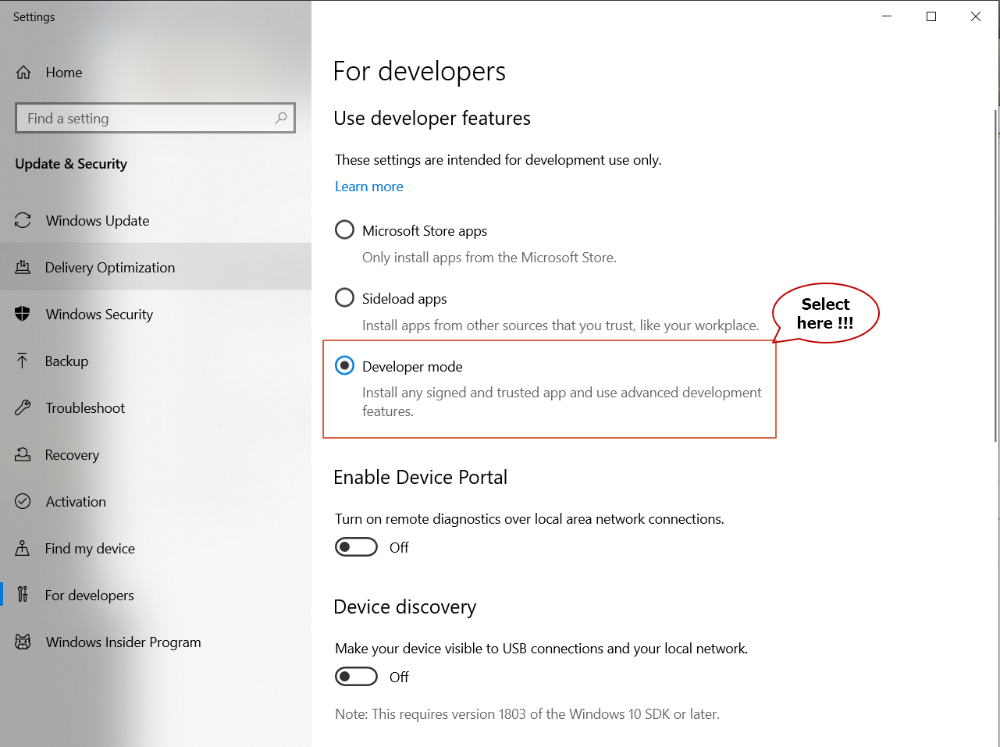

# Docker installation for windows from scratch !!!!

### Here is the step by step Docker installation on windows.

#### 1. Setting windows become developer mode

First step, you need to change your windows to developer mode.




#### 2. Activate WSL on windows

Activate the feature of windows subsystem for Linux(WSL) on your system


#### 3. Enable WSL using power shell, following this [reference](https://docs.microsoft.com/en-us/windows/wsl/install-win10).

- Open PowerShell as administrator

- Enable the Windows Subsystem for Linux

  ```
  $ dism.exe /online /enable-feature /featurename:Microsoft-Windows-Subsystem-Linux /all /norestart
  ```

  

- Enable Virtual Machine feature

  ```
  $ dism.exe /online /enable-feature /featurename:VirtualMachinePlatform /all /norestart
  ```

  

- Set WSL 2 as your default version

  ```
  $ wsl --set-default-version 2
  ```

  If you see this message after running the command: `WSL 2 requires an update to its kernel component. For information please visit https://aka.ms/wsl2kernel`. You still need to install the MSI Linux kernel update package.

  

  Download the Linux kernel update package from [here](https://docs.microsoft.com/en-us/windows/wsl/wsl2-kernel) and install it


#### 4. Install Linux kernel

Open Microsoft store and find the suitable Linux distribution version for your system. for example here use ubuntu 20.04 LTS


After you launch, it will take a few minutes to lets the system install it


Setup your username and password for your Linux system


#### 5. Download docker image from docker hub for windows, visit [this link !!](https://docs.docker.com/docker-for-windows/install/)

Go to the link of docker to download the image docker desktop for windows


Download it !!!


#### 6. Install Docker from the downloaded file

It will ask permission, just click yes!!

#### 7. Start docker desktop

After you install then run it it will show the windows like picture bellow this.


Then now you can use docker from your command prompt to run docker container. for example here command line for run docker hello-world

```
$ doker run hello-world
```


You can monitoring your images or container using docker container apps.


#### ** Finish and good luck **

***Written by: Anto112***